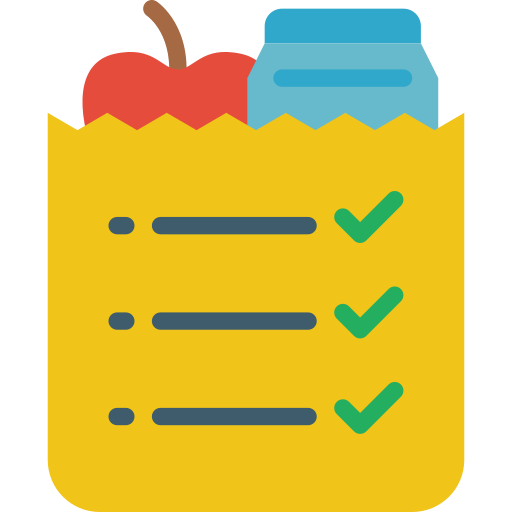

# shopplist

<h1 align="center">
  
</h1>

  

## 💻 Project
A "shopping list" reminds you to buy various items

## :hammer_and_wrench: Features 

-   [ ] Add items
-   [ ] Remove Items

  

## ✨ Technologies 

-   [ ] React Native
-   [ ] Typescript

## Executando o projeto

Utilize o **yarn** ou o **npm install** para instalar as dependências do projeto.
Em seguida, inicie o projeto.

## 📄 Licença

Esse projeto está sob a licença MIT. Veja o arquivo [LICENSE](LICENSE.md) para mais detalhes.

 

  <small>Desenvolvido por Rafael Kenedy - Outubro/2021</small>

   

